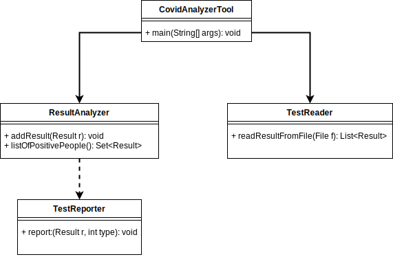
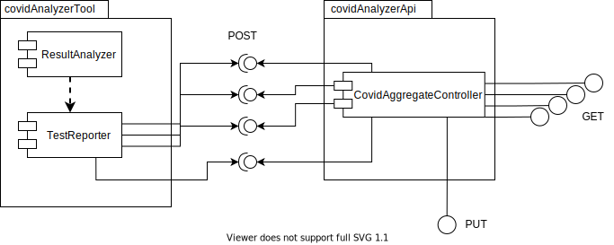
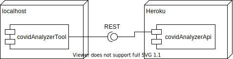

# Escuela Colombiana de Ingeniería Julio Garavito - Examen Final de Primer Tercio

## Sistema de Registros de casos COVID

Usted ha sido contratado para agregar en un sistema todos los resultados de los examenes de COVID realizado a un conjunto de personas en varios hospitales de Bogotá a lo largo de esta pandemia. Para lograrlo, los resultados han sido exportados en archivos `.CSV`, su tarea es agregar la información identificando casos positivos, falsos positivos, falsos negativos y negativos. 

Cada registro expone la información básica de la persona que tomo el test, un resultado positivo no lo es a menos que la fidelidad del test este por encima del 90%.

Por ahora el sistema recorre cada archivo y clasifica el resultado según corresponda, esto lo hace sin aprovechar las propiedades multi-núcleo de los equipos modernos: 







Nota
Puntos 1 y 2: proyecto **covidAnalyzerTool**. Punto 3: proyecto **covidAnalzerApi**.

1. **[33%]** Haga que el programa divida y paralelice el proceso de agregación en exactamente 5 hilos de ejecución, pero deje la posibilidad de cambiar el número de hilos por medio de una constante, para ello cada hilo debe buscar en una porción de archivos diferente.
2. **[33%]** Haga que el programa mantenga inactivos los hilos (sin esperas activas!), hasta tanto no se detecte que el usuario presiono la tecla enter del teclado. Cuando esto ocurra, los hilos deben detenerse y en pantalla debe imprimirse el numero de cuentas casos activos que se han encontrado hasta el momento. Del mismo modo, una vez el usuario presione la tecla enter de nuevo, los hilos deberían activarse de nuevo y seguir agregando la información. Al terminarse la búsqueda en todos los archivos, el programa debe funcionar exactamente igual que el original, imprimiendo los resultados de los casos activos en `TestAnalyzer`.	
3. **[34%]** La clase `TestReporter` automáticamente detecta cuando hay un API REST con la URL `http://localhost:8080/covid/result` para el registro y consulta de los resultados de COVID analizados a través de la aplicación de escritorio. El recurso `http://localhost:8080/covid/result` usa como representación un objeto JSON del resultado del test. Sobre la base del proyecto suministrado (Aplicación en Spring Boot), desarrolle el API requerido por el cliente, el cual mantenga en memoria (por ahora) dichos resultados, pero tenga en cuenta:

	1. Se soporten los verbos `GET`, `POST` para los recursos `/covid/result/true-positive`, `/covid/result/true-negative`, `/covid/result/false-positive`, `/covid/result/false-negative`.
	2. Si una persona ya ha sido registrada, cree un servicio con el verbo `PUT` en el cual debe ser capaz de mantener el id de la persona y el número de veces que se ha realizado el test.
	3. No se den condiciones de carrera ni bloqueos innecesarios.
	4. Se debe realizar la implementación de la clase `CovidAggregateService` y conectarlos con el controlador `CovidAggregateController` usando inyección de dependencias.
	5. Se provee un código base en el API pero usted debe completarlo añadiendo códigos de respuesta, body, parámetros y todo lo que necesite.
	6. Pruebe su algoritmo con pocos archivos y pocos registros para evitar perder tiempo.	

## Bonos

1. **[25%]** Cree un endpoint que retorne todos los tipos de resultados para una fecha de consulta especifica.
2. **[25%]** Para que la solución sea coherente con los diagramas propuestos, publique el API del proyecto (**covidAnalzerApi**) en un ambiente de Heroku, haga que la clase `TestReporter` reporte a esta instancia.

## Entrega

Siga al pie de la letra estas indicaciones para la entrega de este punto. EL HACER CASO OMISO DE ESTAS INSTRUCCIONES PENALIZARÁ LA NOTA.

1. Limpie los dos proyectos. Entre a los directorios 'covidAnalyzerTool' y 'covidAnalzerApi' y ejecute:

```bash
$ mvn clean
```

2. Configure su usuario de GIT

```bash
$ git config --global user.name "Juan Perez"
$ git config --global user.email juan.perez@escuelaing.edu.co
```

3. Desde el directorio raíz (donde está este archivo README.md), haga commit de lo realizado. Mantenga su repositorio privado hasta después de la entrega del parcial, entonces hagalo publico.

```bash
$ git add .
$ git commit -m "entrega parcial - Juan Perez"
```

4. Desde este mismo directorio, comprima todo con: (no olvide el punto al final de la instrucción)

```bash
$ zip -r APELLIDO.NOMBRE.zip .
```

5. Abra el archivo ZIP creado, y rectifique que contenga lo desarrollado.

6. Suba el archivo antes creado (APELLIDO.NOMBRE.zip) en el espacio de moodle correspondiente.

7. IMPORTANTE!. Conserve una copia de la carpeta y del archivo .ZIP.

8. Haga commits recurrentes para verificar su progreso, UN PARCIAL SOLUCIONADO EN 1 SOLO COMMIT SE CONSIDERA COPIA.